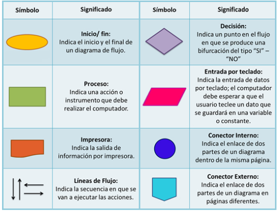

# Actividad 2  
## 📤 Ejercicio 1.

Investiga cuáles son los símbolos que se utilizan para representar cada operación de un algoritmo con un diagrama de flujo. Asegúrate de que la fuente es confiable, discute lo que encontraste con tus compañeros y con el profe. Cuando estés seguro/a de tener los símbolos correctos, consigna la información en la bitácora.    
  

## Ejercicio 2

Analicemos el siguiente problema y representemos su solución mediante un algoritmo secuencial.

- Construye un algoritmo que, al recibir como datos **el ID** del empleado y los seis primeros sueldos del año, calcule el ingreso total semestral y el promedio mensual, e imprima el ID del empleado, el ingreso total y el promedio mensual.      

## Ejercicios

1. Un **acuario** necesita determinar cuántos litros o galones (eso lo decide el usuario) de agua caben en un acuario, pero solo dispone de una cinta métrica (en centímetros). Diseña un algoritmo para solucionar el problema.   

2. Realice un algoritmo para determinar cuánto se debe pagar por equis cantidad de lápices considerando que si son 1000 o más el costo es de $85 cada uno; de lo contrario, el precio es de $90. Represéntelo con el pseudocódigo y el diagrama de flujo.
3. Un almacén de ropa tiene una promoción: por compras superiores a $250 000 se les aplicará un descuento de 15%, de caso contrario, sólo se aplicará un 8% de descuento. Realice un algoritmo para determinar el precio final que debe pagar una persona por comprar en dicho almacén y de cuánto es el descuento que obtendrá. Represéntelo mediante el pseudocódigo y el diagrama de flujo.
4. El director de una escuela está organizando un viaje de estudios, y requiere determinar cuánto debe cobrar a cada alumno y cuánto debe pagar a la compañía de viajes por el servicio. La forma de cobrar es la siguiente: si son 100 alumnos o más, el costo por cada alumno es de $65.00; de 50 a 99 alumnos, el costo es de $70.00, de 30 a 49, de $95.00, y si son menos de 30, el costo de la renta del autobús es de $4000.00, sin importar el número de alumnos.    

# 📤 **Consigna tus respuestas en la bitácora**

A continuación, se presentan enunciados relacionados con los temas tratados en el texto. Los estudiantes deben responder si los enunciados corresponden o no con las definiciones o conceptos aprendidos.

### Parte 1: Identificar Algoritmos

Responde si los siguientes enunciados representan un algoritmo. Justifica la respuesta:

1. Una página web.  
No representa un algoritmo ya que no es una secuencia de pasos para solucionar un problema.
2. Una receta para hacer un pastel, donde se indican ingredientes y pasos a seguir.  
Representa un algoritmo ya que se trata de una serie de pasos finitos para cumplir con algo.
3. "Piensa en un número y multiplícalo por otro".
No representa un algoritmo porque no es algo específico, da información muy general.
4. Un manual de instrucciones para armar un mueble, con pasos detallados y un orden claro.  
Si es un algoritmo pues tiene una serie de pasos finitos para resolver un problema.
5. Una lista de compras organizada en orden alfabético  
Aunque sea una lista no tiene unos pasos, por ende no es un algoritmo.

### Parte 2: Variables y Constantes

Indica si las siguientes afirmaciones describen una variable o una constante:

1. El valor de la gravedad en la Tierra, 9.8 m/s².  
Constante.
2. La edad de una persona calculada con base en el año actual y su año de nacimiento.    
Variable.
3. La cantidad de dinero en una cuenta bancaria.  
Variable.
4. La velocidad de la luz en el vacío, 299,792,458 m/s.  
Constante.
5. El radio de un círculo.    
Variable.

### Parte 3: Características de los Algoritmos

Responde si los siguientes enunciados cumplen con las características de un algoritmo. Justifica la respuesta:

1. Para elegir la ruta más corta entre varias ciudades, el algoritmo examina rutas candidatas, deteniéndose cuando los cambios en la distancia parecen lo suficientemente pequeños.  
No es un algoritmo bien definido porque dice que se detiene cuando los cambios “parecen” pequeños, y eso es algo subjetivo. Un algoritmo debe indicar exactamente cuándo termina.    

2. Suma los números ingresados y muestra el resultado.  
Está incompleto, porque no dice cuántos números se deben ingresar ni cuándo se deja de ingresar datos.  

3. Un conjunto de pasos para calcular el área de un rectángulo dado su base y altura.    

Sí describe un algoritmo, porque tiene datos de entrada (base y altura), un proceso (multiplicar) y un resultado (el área).  

4. El algoritmo cuenta el número de votos obtenidos por cada uno de los candidatos de una elección para presidente. Empieza solicitando el nombre del candidato y finaliza cuando se ingresa el valor -1.  
Sí describe un algoritmo, porque tiene una condición clara de finalización (cuando se ingresa -1), por lo que es finito y está bien definido.  

### Parte 4: Comprensión de Herramientas

Indica si las siguientes afirmaciones son ciertas o falsas respecto al pseudocódigo y diagramas de flujo:

1. El pseudocódigo utiliza símbolos estándar para representar las operaciones lógicas.  
Falso.
2. Los diagramas de flujo son una representación gráfica de un algoritmo.  
Verdadero.
3. El pseudocódigo debe estar escrito en un lenguaje de programación específico.  
Falso.
4. Un diagrama de flujo siempre debe tener un inicio y un fin claramente definidos.      
Verdadero.
### Parte 5: Estructuras de Control

Describe para qué sirven las estructuras de control. Redacta dos ejemplos, uno de tu vida diaria, es decir cuando tienes que tomar decisiones en tus actividades diarias y oto ejemplo en el que se tengan que utilizar cálculos matemáticos para tomar una u otra decisión.  
Solución:  
Las estructuras de control sirven para indicar el orden en que se ejecutan las instrucciones dentro de un algoritmo y para tomar decisiones o repetir procesos según se cumplan ciertas condiciones. Gracias a ellas, un programa puede cambiar su comportamiento dependiendo de los datos que reciba.    

- **Ejemplo de la vida diaria:** 
Cuando llego de clase, reviso si tengo muchas cosas de la universidad por hacer. Si tengo muchas tareas o trabajos pendientes, las hago de una vez; si no, duermo un rato y después hago lo que tenga pendiente.  
- **Ejemplo con cálculos matemáticos:**  Para calcular si puedo ahorrar dinero en el mes, resto mis gastos a mis ingresos. Si el resultado es positivo, puedo ahorrar; si es negativo, debo reducir gastos.
---  
