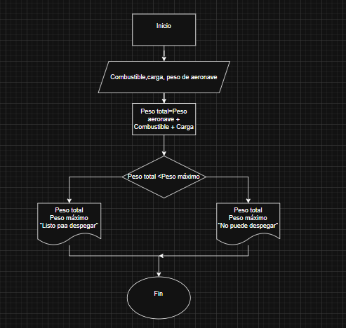

### **Ejercicios con condicionales**

1. **Verificación de peso de despegue**
    
    En una pista de pruebas de aeronaves, el sistema debe verificar si el peso total de la aeronave, incluyendo combustible y carga, supera el límite máximo permitido para el despegue. Dependiendo del resultado, el sistema deberá indicar si la aeronave está lista para despegar o si debe reducir carga o combustible.  
    

2. **Control de combustible en pruebas**
    
    Durante un ensayo en banco de un motor a reacción, se mide el nivel de combustible cada minuto y se detiene el registro cuando el combustible baja del 10%. Mostrar el tiempo total de operación antes de llegar a ese punto.

Entradas:  
|Nombre|Descripción|  
|-|-|  
|Combustible inicial|Es la cantidad de combustible ingresada por el usuario  
|Combustible| Es el combustible que se mide cada minuto, es dado por el sensor.
|Capacidad máxima| Es la mayor cantidad posile de combustible que puede tener el tanque

Salida:  
|Nombre|Descripción|  
|-|-|  
Tiempo|Tiempo total de operación antes de que el combustible baje del 10%
Combustible|Indica cuánto combustible queda en el tanque

Variable de control:
|Nombre|Descripción|
|-|-|  
Tiempo|Tiempo de operación 
Combustible|Cantidad de combustible

Pseudocódigo:   
Inicio  
Leer capacidad, Combustible  
Limite = 0.1  
Tiempo = 0
Mientras cimbustible > capacidad*Límite    
        Leer Combustible  
        Tiempo = Tiempo + 1   
    Fin mientras  
Mostrar Combustible,Tiempo  
Fin    

3. **Control de temperatura en cabina**
    
    Un sistema mide cada 5 minutos la temperatura en cabina durante una hora. Si en algún momento se detecta una temperatura mayor a 27°C o menor a 18°C, debe indicar que se active el sistema de climatización.
    
Entradas: 
|Nombre|Deescripción|
|-|-|  
Temperatura|Temperatura medida por el sensor

    
